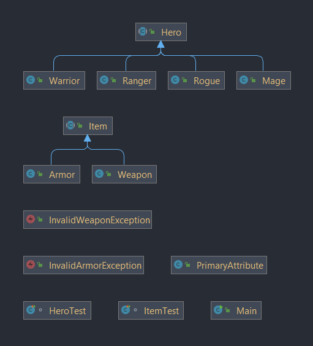

# rpg-hero

[](https://github.com/RichardLitt/standard-readme)

Noroff Java Fullstack bootcamp Assignment 5: RPG Characters. A console application built in Java

In the RPG Character game there is a Hero which can be a class Mage, Warrior, Ranger or Rogue and the basic attributes (strength, dexterity and Intelligence) 
change according to the class. Hero can wear item (weapon or armor) and used item affect attributes. Hero can level up which increase attributes and "opens" 
more items to wear. The game is not a fully built version with an excellent interface but a "base" illustrating the requirements used in the Main class. 
Hero and Items are constructed with required fields. Hero stats are displayed through toString () method.

Built with IntelliJ idea U ltimate and JDK 17.




## Table of Contents

- [Install](#install)
- [Usage](#usage)
- [Maintainers](#maintainers)
- [Contributing](#contributing)
- [License](#license)

## Install
Clone:
```
https://github.com/teemunasanen/RPG_characters.git
```

## Usage
IDE of your choice example IntelliJ, Eclipse, Netbeans...

Construct Heroes and Items in Main class.

## Maintainers

[@teemunasanen](https://github.com/teemunasanen)

## Contributing

PRs accepted.

Small note: If editing the README, please conform to the [standard-readme](https://github.com/RichardLitt/standard-readme) specification.

## License

MIT © 2022 Teemu Näsänen
